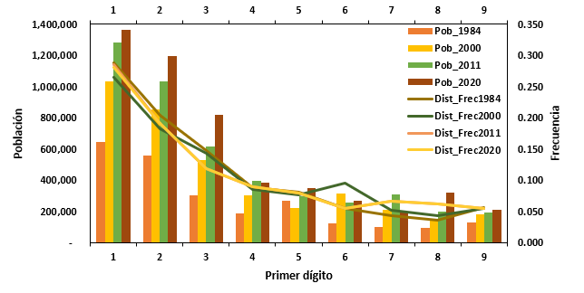

1984Sitio web de ejemplo 
====================

Este es un sitio web de ejemplo para mostrar la funcionalidad de [GitGub Pages](https://pages.github.com/).

Notas sobre investigación reproducible y análisis de datos
Reproductibilidad

El término reproductibilidad (o reproducibility, en inglés) se refiere a la capacidad de reproducir un trabajo de investigación, de manera que sus resultados puedan ser obtenidos por otros al seguir la misma metodología. Usualmente, la reproductibilidad requiere que los datos y el código de programación utilizados en la investigación estén disponibles para quienes deseen usarlos (Bezjak et al., 2018). Este concepto está relacionado con el de replicabilidad (o replicability, en inglés), el cual se refiere a la posibilidad de obtener resultados consistentes (no idénticos) al replicar un estudio con un conjunto distinto de datos, pero siguiendo el mismo diseño experimental. Estos conceptos son elementos centrales de la investigación empírica.
Importancia de la reproductibilidad

## Ejemplo personal

Se presenta el resultado de aplicar la  [_**Ley de Benford**_](https://es.wikipedia.org/wiki/Ley_de_Benford) o _**Ley del primer dígito**_. En la distribución espacial de la población en Costa Rica . Los datos con los que se parte del análisis corresponden a la población según cantón  en 1984, 2000, 2011 y 2020. Se pueden consultar en  [**Proyecciones de la Población**](http://services.inec.go.cr/proyeccionpoblacion/frmproyec.aspx), del  [**Inec**](https://www.inec.cr/).

  
 
Figura 1. Resultado de la revisión de los datos segun cantón.  
Nota. Elaboración propia.

## Resultados
Se comprueba que la _Ley de Benford_ aplica en la distribucion espacial de la población costarricense.

#### Bibliográfia

Castañeda, G. (enero de 2011). La ley de Benford y su aplicabilidad en el análisis forense de resultados electorales. Política y gobierno, 18(2). Obtenido de http://www.scielo.org.mx/scielo.php?script=sci_arttext&pid=S1665-20372011000200004

es.wikipedia.org. (2020). es.wikipedia.org. Obtenido de Ley de Benford: https://es.wikipedia.org/wiki/Ley_de_Benford

Instituto Nacional de Estadística y Censos. (2011). Sistema de Consulta de Proyecciones de Población Distritales [base de datos]. Obtenido de inec.go.cr: http://www.inec.go.cr/proyeccionpoblacion/frmproyec.aspx

